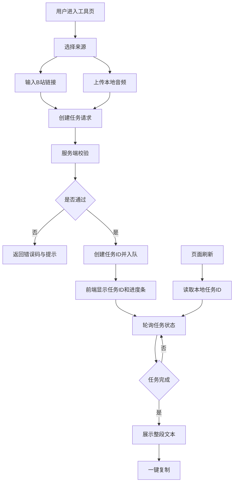

# Bilibili 音频转文字工具 MVP 方案

## 1. 目标与边界

- 入口放在前台工具区 [`TOOL_ITEMS`](next-portal/src/constants/tools.ts:26)
- 页面路由沿用 [`[slug]/page.tsx`](next-portal/src/app/(frontend)/coding-tools/[slug]/page.tsx:38)
- 支持两种输入
  - Bilibili 链接
  - 本地音频上传
- 输出仅整段文本
- 支持一键复制
- 显示任务进度条
- 显示任务 ID 并支持按任务 ID 找回任务
- MVP 仅覆盖 10 分钟内内容
- 暂停模型选型争论，后端做可插拔转写适配层

## 2. 现有接入点

- 工具卡片数据源在 [`TOOL_ITEMS`](next-portal/src/constants/tools.ts:26)
- 工具详情按 `slug` 渲染组件在 [`ToolDetailPage`](next-portal/src/app/(frontend)/coding-tools/[slug]/page.tsx:38)
- 现有工具组件风格参考
  - [`PromptPolisherPlayground`](next-portal/src/components/tools/PromptPolisherPlayground/index.tsx:9)
  - [`ProfileCardPlayground`](next-portal/src/components/tools/ProfileCardPlayground.tsx:11)

## 3. UI 风格对齐规范

统一复用前台首页卡片体系，不以当前工具页测试卡片为视觉基准。

- 视觉基准
  - 以首页工具区卡片 [`home-tool-card`](next-portal/src/app/(frontend)/page.tsx:272) 为主基准
  - 样式 token 与 hover 行为对齐 [`globals.css`](next-portal/src/app/(frontend)/globals.css:1260)
- 动画基准
  - 卡片入场节奏对齐工具区现有序列动画 [`globals.css`](next-portal/src/app/(frontend)/globals.css:1883)
  - hover 位移与阴影变化沿用首页卡片动效规范 [`globals.css`](next-portal/src/app/(frontend)/globals.css:1271)
  - 过渡时长和 easing 与首页同族，不单独定义突兀动画
  - 遵循 `prefers-reduced-motion` 降级策略 [`globals.css`](next-portal/src/app/(frontend)/globals.css:1826)
- 布局
  - 外层保持工具详情页现有容器与留白
  - 内容区采用双栏栅格，移动端单栏
- 卡片
  - 输入区与结果区都使用首页同族卡片质感
  - 统一边框、背景、阴影、悬浮位移与过渡节奏
- 控件
  - 复用 [`Button`](next-portal/src/components/ui/button.tsx)
  - 复用 [`Input`](next-portal/src/components/ui/input.tsx)
  - 复用 [`Textarea`](next-portal/src/components/ui/textarea.tsx)
  - 统一按钮层级，主按钮风格贴合首页 CTA 语义
- 反馈
  - 提交中按钮禁用并显示 loading 文案
  - 成功后展示转写文本与复制按钮
  - 错误在结果区展示统一错误文案
  - 空状态与提示文案风格对齐首页信息卡

## 4. 前端实现计划

### 4.1 新增工具元数据

在 [`TOOL_ITEMS`](next-portal/src/constants/tools.ts:26) 新增条目

- `slug`: `bilibili-audio-transcriber`
- `title`: Bilibili 音频转文字
- `summary`: 支持 B 站链接或本地音频上传，输出可复制全文
- `status`: `available`
- `category`: `tech`

### 4.2 新增组件

新增文件

- [`BilibiliAudioTranscriberPlayground.tsx`](next-portal/src/components/tools/BilibiliAudioTranscriberPlayground.tsx)

组件职责

- 来源切换 Tabs
  - 链接模式
  - 上传模式
- 表单字段
  - 链接模式：视频 URL 输入
  - 上传模式：音频文件 input
- 提交后创建任务并展示任务状态面板
  - 任务 ID
  - 当前状态
  - 进度条
  - 进度文案
- 页面刷新后自动从本地缓存恢复最近任务 ID
- 支持手动输入任务 ID 查询进度与结果
- 结果区展示纯文本
- 复制按钮调用 `navigator.clipboard.writeText`

### 4.3 详情页挂载

在 [`ToolDetailPage`](next-portal/src/app/(frontend)/coding-tools/[slug]/page.tsx:38) 增加 slug 分支渲染新组件。

## 5. 后端接口与处理链路

### 5.1 API 路由

新增路由

- [`route.ts`](next-portal/src/app/(frontend)/next/transcribe/route.ts)

请求协议

- `POST multipart/form-data` 创建任务
- 字段
  - `sourceType`: `bilibili` 或 `upload`
  - `url`: 当 `bilibili` 时必填
  - `file`: 当 `upload` 时必填

- `GET /next/transcribe/{taskId}` 查询任务

响应协议

- 创建成功
  - `{ taskId, status, progress }`
- 查询成功
  - `{ taskId, status, progress, text, error, meta }`
- 失败
  - `{ error: { code, message } }`

### 5.2 服务拆分

建议新增服务层

- [`transcription.ts`](next-portal/src/app/(frontend)/next/transcribe/transcription.ts)
- [`extract-audio.ts`](next-portal/src/app/(frontend)/next/transcribe/extract-audio.ts)
- [`validate.ts`](next-portal/src/app/(frontend)/next/transcribe/validate.ts)

职责划分

- `validate`
  - 校验来源
  - 校验 URL 格式
  - 校验文件类型和大小
  - 校验时长上限 10 分钟
- `extract-audio`
  - B站模式下载音频并转标准格式
  - 上传模式标准化转码
- `transcription`
  - 封装转写引擎调用接口
  - 返回整段文本
- `task-store`
  - 管理任务状态机
  - 持久化任务进度与结果
  - 支持按 `taskId` 查询

### 5.3 外部模型服务接入规范

MVP 的外部接入重点是 ASR 不是 TTS。TTS 属于朗读能力，放到后续阶段。

- 统一适配接口
  - `transcribeAudio` 输入标准音频路径与语言参数
  - 返回统一结果 `text` 和 `usage` 字段
- Provider 枚举
  - `openai_asr`
  - `azure_speech_asr`
  - `custom_asr_http`
- 推荐调用链
  - `route.ts` 只处理协议和任务
  - `transcription.ts` 根据 provider 分发
  - 各 provider 实现在 `providers` 目录
- TTS 扩展位
  - 预留 `tts-provider.ts` 但不进入本期 MVP 验收
  - 若后续需要可新增 `POST /next/transcribe/{taskId}/tts`

### 5.4 成本优先的 Provider 策略

考虑你提到的免费额度，MVP 增加可配置优先级与降级顺序。

- 默认策略
  - 首选 `azure_speech_asr`
  - 失败或额度不足时降级到 `openai_asr`
  - 再降级到 `custom_asr_http`
- 配置方式
  - 新增 `TRANSCRIBE_PROVIDER_CHAIN` 支持逗号序列
  - 示例 `azure_speech_asr,openai_asr,custom_asr_http`
- 错误处理
  - 识别到额度或鉴权错误时自动尝试下一 provider
  - 所有 provider 失败后回传统一错误 `TRANSCRIBE_FAILED`
- 可观测性
  - 在 `meta.provider` 返回实际命中的 provider
  - 记录 provider 级失败原因便于后续调价与切换

## 6. 抽音与时长控制策略

- 统一转码格式
  - `wav`
  - `16k`
  - `mono`
- 长度策略
  - 超过 10 分钟直接拒绝
  - 返回错误码 `DURATION_EXCEEDED`
- 大小策略
  - 请求体最大体积限制
- 文件策略
  - 仅允许常见音频格式

## 7. 稳定性与安全

- 临时目录隔离与请求级路径
- 请求结束后强制清理临时文件
- API 超时与下载超时
- 并发保护
  - 简单信号量上限
- 任务存储策略
  - 任务状态机 `queued/running/succeeded/failed`
  - 记录阶段进度 0 到 100
  - 任务结果保留 TTL 便于刷新找回
- SSRF 防护
  - 仅允许 bilibili 合法域名
- 错误码规范
  - `INVALID_INPUT`
  - `UNSUPPORTED_SOURCE`
  - `TASK_NOT_FOUND`
  - `DOWNLOAD_FAILED`
  - `DURATION_EXCEEDED`
  - `TRANSCRIBE_FAILED`
  - `INTERNAL_ERROR`

## 8. 配置与部署

- 新增环境变量
  - `TRANSCRIBE_PROVIDER`
  - `TRANSCRIBE_API_KEY`
  - `TRANSCRIBE_TIMEOUT_MS`
  - `TRANSCRIBE_MAX_MINUTES`
  - `TRANSCRIBE_MAX_UPLOAD_MB`
  - `AZURE_SPEECH_KEY`
  - `AZURE_SPEECH_REGION`
  - `CUSTOM_ASR_ENDPOINT`
  - `CUSTOM_ASR_TOKEN`
  - `TRANSCRIBE_PROVIDER_CHAIN`
- 系统依赖
  - `ffmpeg`
  - B站音频下载依赖
- 文档更新
  - [`README.md`](next-portal/README.md)
  - 如有部署细节同步到 [`DEPLOY.md`](next-portal/DEPLOY.md)

## 9. 测试与验收

### 9.1 功能验收

- 链接模式成功返回整段文本
- 上传模式成功返回整段文本
- 可一键复制文本
- 转写过程中可见实时进度条
- 可显示任务 ID 并复制任务 ID
- 页面刷新后可自动恢复最近任务状态
- 可通过输入任务 ID 找回任务与结果

### 9.2 边界验收

- 超过 10 分钟返回明确错误
- 非 B 站链接拦截
- 非音频文件拦截
- 超大文件拦截

### 9.3 自动化覆盖

- API 层最小集成测试
- 前端最小 e2e
  - 来源切换
  - 成功路径
  - 错误提示
- 动画与体验一致性检查
  - 新工具卡片入场顺序与首页工具区节奏一致
  - `prefers-reduced-motion` 开启时动画正确降级

## 10. 任务拆分清单

1. 更新工具元数据并开放入口
2. 新建工具前端组件并完成双来源表单
3. 新建转写任务 API 路由与输入校验
4. 实现任务状态存储与任务 ID 查询接口
5. 接入抽音转码与 10 分钟时长限制
6. 接入转写适配层并回填任务进度
7. 完成进度条 任务 ID 展示 复制与找回交互
8. 增加安全策略和临时文件清理
9. 补充测试与文档

## 11. 流程图

