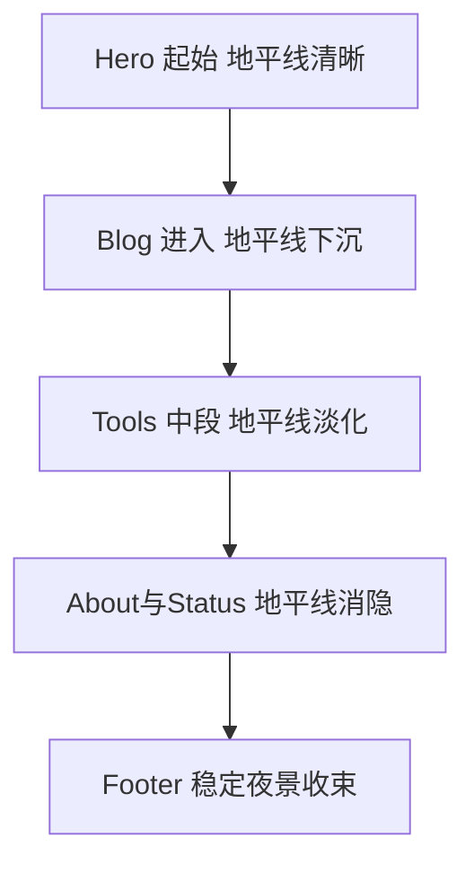

# Homepage Round 2 视觉优化方案

## 方向确认
- 风格路线：**平衡路线**
- 关键词：Tokyo Night Storm、老苹果玻璃感、中等荧光、滚动渐变叙事
- 约束：荧光不喧宾夺主，优先可读性与信息层级

## 1. 模块级改造清单

### Hero 区
- 保留当前文案与结构，只做视觉强化
- 增加顶部到首屏中段的“地平线雾层”渐变
- 主按钮维持高识别蓝紫发光，次按钮降低饱和
- 状态侧栏与主面板形成双层玻璃厚度对比

### Blog 区
- 精选卡采用更高层级玻璃材质，强化标题焦点
- Recent 列表卡统一边框亮度与 hover 发光半径
- 右侧 Wandering 入口从虚线卡升级为薄玻璃卡

### Tools 区
- 工具卡片统一材质语言，与 Blog 卡同一套令牌
- Available 徽标荧光降低面积，保留高识别度
- 右上角小圆点改为更柔和的双层辉光

### About 区
- 文本容器透明度微升，增强与背景人物的分离
- 操作链接采用低对比线性高亮，避免抢主视觉

### Status 区
- 进度条加入轻微霓虹边缘光与玻璃轨道
- PHASE 标签与 ACTIVE 文案形成冷暖层次

## 2. 设计令牌定义

### 颜色与光效
- 背景主色：深海军蓝黑
- 主荧光：蓝青偏紫
- 次荧光：低饱和青蓝
- 文本主色：高亮冷白
- 文本次色：低对比冷灰蓝

### 玻璃材质
- 卡片底：中低透明暗色
- 边框：半透明冷白
- 内阴影：轻微内发光
- 背景模糊：中等强度，滚动阶段可渐变

### 阴影与层级
- 近景卡：短阴影+轻内描边
- 中景卡：中等阴影+弱辉光
- 浮层控件：较高阴影+低面积荧光边

### 动效
- hover：位移极小、亮度微升、阴影扩散
- section reveal：透明度与位移渐入
- scroll narrative：背景渐变与雾层强度分段变化

## 3. 地平线消失滚动叙事

将首页滚动分为 4 个阶段，随着滚动推进让地平线从可见到消隐：

1. Hero 起始：地平线最清晰，荧光最克制
2. Blog 进入：地平线开始下沉，雾层上浮
3. Tools 中段：地平线变淡，卡片玻璃层次成为主角
4. About 与 Status：地平线几乎消失，页面进入稳定夜景态

## 4. 实施顺序

1. 建立 round2 视觉令牌变量
2. 重构首页各模块卡片材质基类
3. 按模块落地 Hero Blog Tools About Status
4. 接入滚动分段类名与渐变叙事
5. 调整交互细节 hover active focus
6. 响应式校正与可读性验收

## 5. 验收标准

- 灵动岛与内容卡片材质统一但不雷同
- 中等荧光存在感明确但不压正文
- 滚动时可感知地平线消失过程
- 首页信息层级清晰，文字可读性稳定
- 深色主题下无突兀高亮块与边缘噪点
