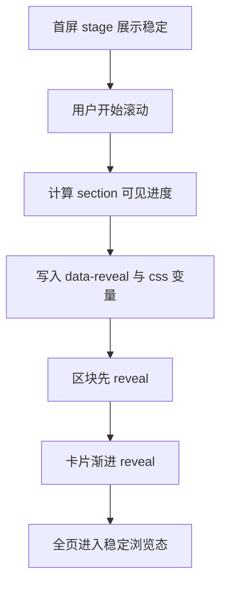

# Homepage V3 Plan 首屏展示块 + 滚动渐进弹出

## 目标
- 首屏是一个完整的大展示块，视觉重心稳定
- 滚动多少，模块就弹出多少，形成连续 reveal
- 保留 Tokyo Night Storm 基调，但整体降饱和
- 全部内容卡片统一为半透明毛玻璃，避免突兀分层

## 设计决策
1. 结构分层
   - `home-top-stage` 作为首屏主舞台，最小高度接近 100vh
   - `home-content-surface` 作为 reveal 容器，承载后续模块
2. 触发模型
   - 用滚动进度驱动 CSS 变量与 data-state，不使用重动画脚本
   - 以 section 进入视口比例作为 reveal 进度
3. 动画节奏
   - 区块先出现，卡片后出现
   - 位移+透明度组合，避免弹跳感
4. 色彩策略
   - Tokyo Night Storm 低饱和版本，减少高纯度霓虹
   - 高光只保留在按钮、状态点、焦点边框

## 实施步骤
1. 首页结构改造
   - 在 `page.tsx` 中为模块添加 reveal 分组与阶段标识
   - 统一 class 命名，便于样式和触发对齐
2. 滚动进度驱动
   - 新建轻量客户端控制组件，更新 `data-reveal` 与 CSS var
   - 按 section 的可见进度映射到 0 到 1
3. 模块 reveal 动画
   - section 容器做 `opacity + translateY`
   - 卡片做轻微延迟，保证层次连续
4. 低饱和 Tokyo Night 调色
   - 重标定 `--hp-*`，降低荧光色彩权重
   - 统一卡片背景 alpha、边框亮度、阴影强度
5. 降级策略
   - `prefers-reduced-motion` 直接展示内容
   - 移动端减少位移距离和模糊强度
6. 验收
   - 桌面端与移动端截图对比
   - 微调阈值、卡片融合度、标题可读性

## 影响文件
- `src/app/(frontend)/page.tsx`
- `src/app/(frontend)/globals.css`
- `src/components/home/HomeScrollRevealController.tsx` 新增

## Mermaid 流程

## 验收标准
- 首屏第一眼无突兀遮罩与割裂层
- 滚动过程连续，模块不会突然整块跳出
- 卡片与背景融合自然，毛玻璃层次清晰
- 动效关闭模式下仍保持良好可读与层次
