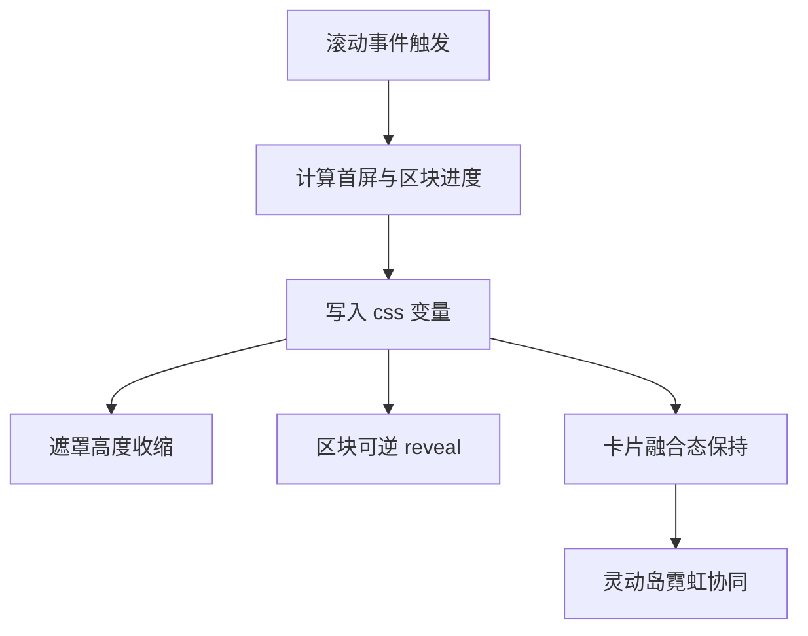

# Homepage V4 热修复与交互重构方案

## 已确认目标
- 滚动弹出改为可逆，向下出现，向上退回，和滚动进度绑定
- 灰色遮罩随滚轮向下收缩，到内容区后消失
- 卡片颜色与背景统一，减少突兀
- 灵动岛增加低强度霓虹光效并与页面主色融合

## 根因复盘
1. 首屏底部亮块
   - `home-hero--portal::after` 的大径向光斑过强
   - `home-content-surface` 透明叠加 `bgfx__overlay` 固定视口渐变，边界可见
2. 弹出只触发一次
   - `HomeScrollRevealController` 采用 `IntersectionObserver + unobserve`，天然单次触发
3. 卡片突兀
   - 卡片明度和边框对比高于背景层，层次断裂

## 改造策略
### A. 滚动进度驱动系统
- 用 `requestAnimationFrame` + `scroll` 计算实时进度
- 写入全局 CSS 变量
  - `--hero-mask-progress` 用于首屏遮罩收缩
  - `--section-progress-n` 用于各模块可逆 reveal
- 不再使用单次 `data-revealed` 逻辑

### B. 遮罩动态收缩
- `bgfx__overlay` 改为通过 CSS 变量控制高度与透明度
- 在首屏滚动阶段逐步缩短遮罩可见区
- 到内容区阈值后遮罩收敛到最小

### C. 卡片融合重标定
- 降低卡片底色明度对比
- 边框亮度降低并加轻微内阴影
- Hover 仅做轻微亮度提升，不做强发光

### D. 灵动岛霓虹融合
- 在 `site-header[data-scrolled=true]` 的外层阴影中加入低强度蓝紫霓虹
- 强度受控，避免喧宾夺主

## 文件级实施清单
1. `src/components/home/HomeScrollRevealController.tsx`
   - 从单次 observer 改为可逆进度控制器
2. `src/app/(frontend)/page.tsx`
   - 为 section 增加稳定索引标记 `data-section-index`
3. `src/app/(frontend)/globals.css`
   - 删除首屏过强光斑
   - 改造遮罩为滚动变量驱动
   - reveal 动画改为进度映射
   - 卡片色板融合重标定
   - 灵动岛霓虹阴影微调

## Mermaid 流程

## 验收标准
- 不再出现首屏底部脏亮块
- 模块随滚动连续变化，回滚时可逆
- 卡片与背景融合自然
- 灵动岛有微弱霓虹但不抢视觉中心
