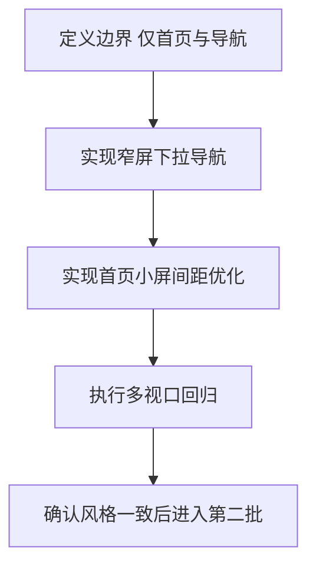

# 移动端适配第一批计划 首页 + 灵动岛导航

## 目标
- 仅适配手机与平板
- 保持现有视觉语言不变
- 桌面端体验与样式不回退
- 第一批只覆盖首页与导航系统

## 范围
- 页面
  - 首页 `src/app/(frontend)/page.tsx`
- 组件
  - 顶部导航 `src/Header/Nav/index.tsx`
  - 全局样式 `src/app/(frontend)/globals.css`
  - 前台布局入口 `src/app/(frontend)/layout.tsx`

## 设计约束 不可改变
- 不改品牌色和渐变体系
- 不改字体族与字重体系
- 不改灵动岛核心动效节奏
- 不改内容信息架构与导航项语义

## 第一批实施策略

### 1 窄屏灵动岛改为 下拉菜单模式
- 条件
  - 小于 md 断点时启用下拉菜单
  - md 及以上保持现有横向灵动岛导航
- 交互
  - 保留现有灵动岛容器视觉
  - 右侧显示菜单触发按钮
  - 点击后下拉展示完整导航项
  - 支持点击外部区域收起
  - 支持 Esc 收起
- 样式
  - 复用现有玻璃态 背景 边框 阴影 过渡
  - 下拉面板与当前岛态风格统一
  - 激活项继续保留当前 active 视觉逻辑

### 2 首页首屏 Hero 小屏密度优化
- 只调整布局和间距
  - 文案与按钮区减少横向占用
  - 卡片内边距在小屏下收敛
  - 保留标题层级与视觉焦点
- 保留
  - 背景 FX
  - 现有渐变字与徽章风格
  - 现有动效与滚动提示语义

### 3 首页网格节奏微调
- 只在小屏做留白和栅格节奏优化
- 不改卡片视觉语言
- 不改内容排序

## 组件级改造清单
- `src/Header/Nav/index.tsx`
  - 增加窄屏菜单开关状态
  - 增加下拉面板结构
  - 复用现有 link active 逻辑
- `src/app/(frontend)/globals.css`
  - 增加窄屏导航样式块
  - 增加下拉面板动画和交互态样式
  - 补充首页窄屏间距收敛规则
- `src/app/(frontend)/page.tsx`
  - 尽量不改结构 仅必要 class 微调

## 验收标准
- 视觉一致性
  - 与当前桌面风格一致
  - 不出现新的视觉主题或突兀样式
- 功能完整性
  - 手机端导航可完整访问全部入口
  - 下拉开关可用 可关闭 无遮挡关键内容
- 回归稳定性
  - 桌面端截图对比无差异或仅不可感知差异
  - 无横向滚动条
  - 关键交互可点击

## 回归检查视口
- 390 x 844 手机
- 768 x 1024 平板竖屏
- 1024 x 1366 平板横屏
- 1440 x 900 桌面基线

## 执行顺序
1. 先做导航窄屏下拉模式
2. 再做首页 Hero 小屏密度优化
3. 再做首页网格与留白微调
4. 最后做桌面回归与截图比对

## Mermaid 流程

