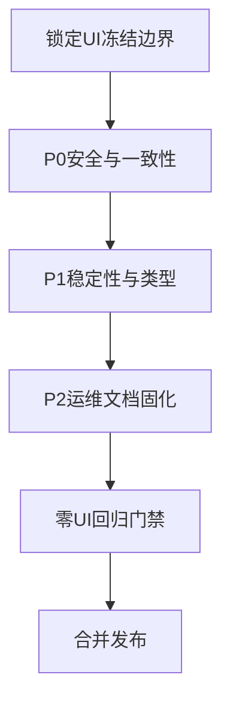

# next-portal 非 UI 改造实施计划

> 目标：在不改变前端视觉与交互观感的前提下，完成安全、工程一致性、稳定性与可维护性整改。
> 约束：用户可见 UI 保持完全一致。

---

## 1. 硬约束与冻结边界

### 1.1 UI 冻结原则
- 禁止修改页面样式、布局、间距、字体、颜色、动画、文案、图标、按钮外观。
- 禁止新增或删除任何用户可见页面元素。
- 禁止调整前端组件渲染结构导致视觉差异。

### 1.2 可改与不可改范围

**可改范围**
- 权限与访问控制逻辑：[`authenticatedOrPublished`](next-portal/src/access/authenticatedOrPublished.ts:3)
- 服务端查询参数与安全策略：[`queryPageBySlug`](next-portal/src/app/(frontend)/[slug]/page.tsx:94)、[`queryPostBySlug`](next-portal/src/app/(frontend)/posts/[slug]/page.tsx:97)
- 工程与容器配置：[`Dockerfile`](next-portal/Dockerfile)、[`docker-compose.yml`](next-portal/docker-compose.yml)
- 常量与工具函数：[`getClientSideURL`](next-portal/src/utilities/getURL.ts:12)
- 测试与文档：[`frontend.e2e.spec.ts`](next-portal/tests/e2e/frontend.e2e.spec.ts)

**冻结范围**
- UI 组件外观相关文件：[`globals.css`](next-portal/src/app/(frontend)/globals.css)、[`portal.css`](next-portal/src/app/(standalone)/private/portal/portal.css)
- 前端视觉组件与页面展示结构：[`HomePage`](next-portal/src/app/(frontend)/page.tsx:37)、[`PortalClient`](next-portal/src/app/(standalone)/private/portal/PortalClient.tsx:109)

---

## 2. 分批实施计划

## P0 安全与一致性

### P0-1 访问控制修复
- 目标：消除草稿预览链路潜在访问绕过。
- 动作：
  - 将查询调用中的 `overrideAccess` 统一为 `false`。
  - `draft` 仅控制草稿版本读取，不参与 access override。
- 重点文件：
  - [`queryPageBySlug`](next-portal/src/app/(frontend)/[slug]/page.tsx:94)
  - [`queryPostBySlug`](next-portal/src/app/(frontend)/posts/[slug]/page.tsx:97)

### P0-2 工程环境收敛
- 目标：消除本地与容器运行漂移。
- 动作：
  - 统一 Node 主版本策略。
  - 统一包管理器策略并修正 compose 启动命令。
  - 明确开发与部署数据库连接语义。
- 重点文件：
  - [`Dockerfile`](next-portal/Dockerfile)
  - [`docker-compose.yml`](next-portal/docker-compose.yml)
  - [`package.json`](next-portal/package.json)

### P0-3 私有门户配置外置
- 目标：去除客户端硬编码地址，提升安全与运维可控性。
- 动作：
  - 将服务列表迁移为服务端配置源。
  - 页面服务端读取后传给客户端。
  - 客户端仅渲染数据，不携带固定地址常量。
- 重点文件：
  - [`PortalClient`](next-portal/src/app/(standalone)/private/portal/PortalClient.tsx:109)
  - [`PortalPage`](next-portal/src/app/(standalone)/private/portal/page.tsx:7)

---

## P1 稳定性与类型安全

### P1-1 分页一致性修复
- 目标：统一分页 `limit` 与总页数计算。
- 动作：
  - 引入统一分页常量。
  - 替换所有 posts 分页处的 magic number。
- 重点文件：
  - [`Page`](next-portal/src/app/(frontend)/posts/page/[pageNumber]/page.tsx:20)
  - [`generateStaticParams`](next-portal/src/app/(frontend)/posts/page/[pageNumber]/page.tsx:72)

### P1-2 动态渲染类型修复
- 目标：逐步移除 `any` 与 `ts-expect-error`。
- 动作：
  - 为表单字段映射建立类型联合。
  - 为动态 block 建立 `blockType` 到组件 props 的映射类型。
- 重点文件：
  - [`FormBlock`](next-portal/src/blocks/Form/Component.tsx:22)
  - [`RenderBlocks`](next-portal/src/blocks/RenderBlocks.tsx:19)

### P1-3 测试可信度提升
- 目标：测试结果真实反映当前站点行为。
- 动作：
  - 替换模板文案断言为当前业务锚点。
  - 增加 preview 和权限回归用例。
- 重点文件：
  - [`Frontend`](next-portal/tests/e2e/frontend.e2e.spec.ts:3)
  - [`Admin Panel`](next-portal/tests/e2e/admin.e2e.spec.ts:5)
  - [`API`](next-portal/tests/int/api.int.spec.ts:8)

---

## P2 运维规范固化

### P2-1 文档补齐
- 目标：降低新成员接入与线上运维不确定性。
- 动作：
  - 将部署实录中的关键注意事项沉淀到正式文档。
  - 明确 build-time 与 runtime 环境变量边界。
- 重点文件：
  - [`README.md`](next-portal/README.md)
  - [`DEPLOY.md`](next-portal/DEPLOY.md)

---

## 3. 零 UI 回归门禁

每个批次合并前必须通过以下门禁：

1. 关键页面视觉快照对比一致。
2. 关键路径手测一致：首页、文章页、分类页、私有门户页。
3. 不允许出现 className 改动、CSS 改动、文案改动。
4. 测试通过且无新增视觉差异。

建议门禁命令清单：
- `pnpm lint`
- `pnpm test:int`
- `pnpm test:e2e`
- `pnpm dev` 后进行关键页面人工对比

---

## 4. 实施流程图

---

## 5. 验收标准

- 安全：草稿预览链路访问控制符合预期。
- 工程：本地与容器运行行为一致。
- 稳定：分页结果与页码一致，测试断言有效。
- 可维护：关键动态渲染类型风险下降。
- UI：改造前后用户可见前端观感保持一致。
